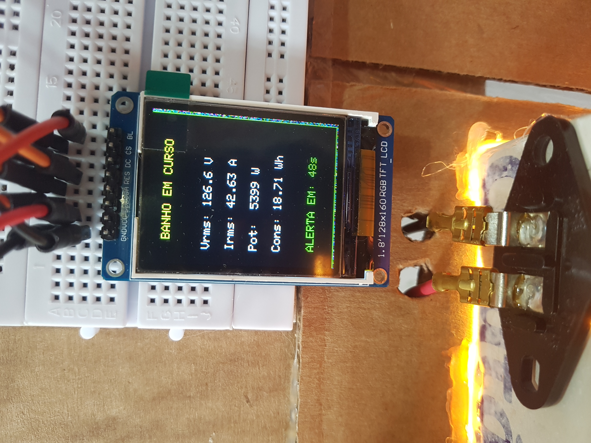
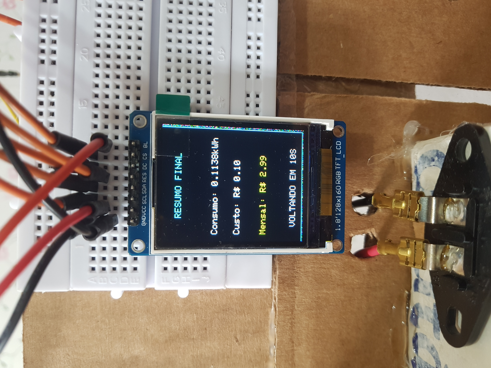
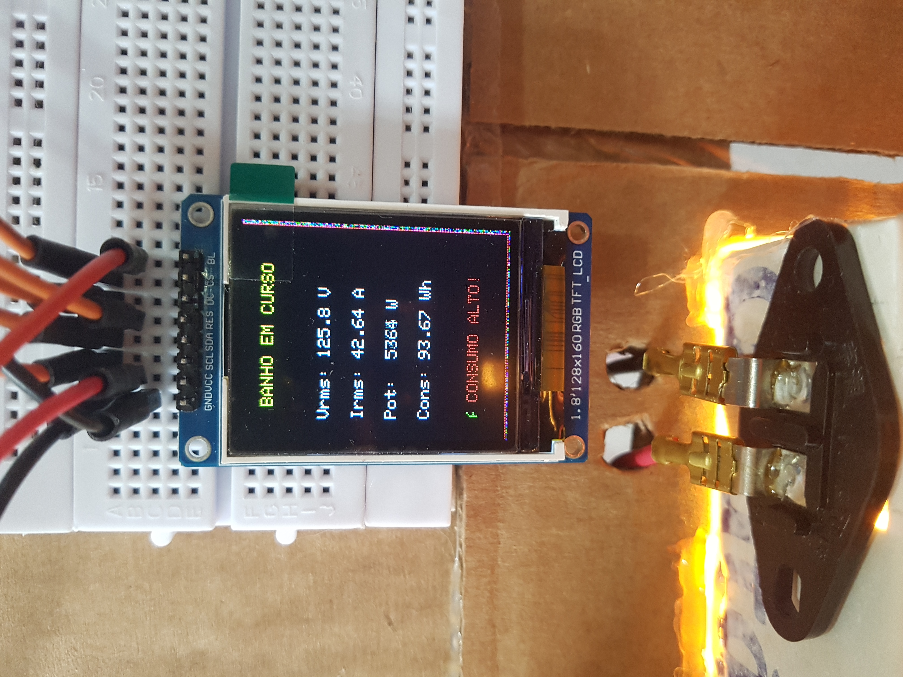
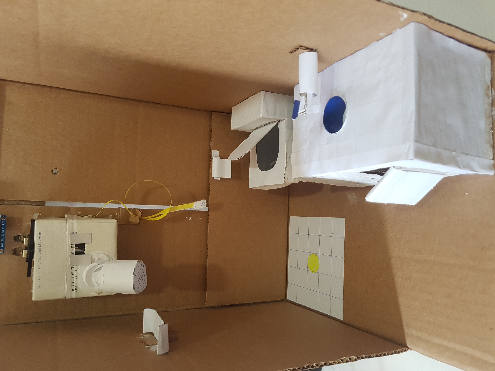
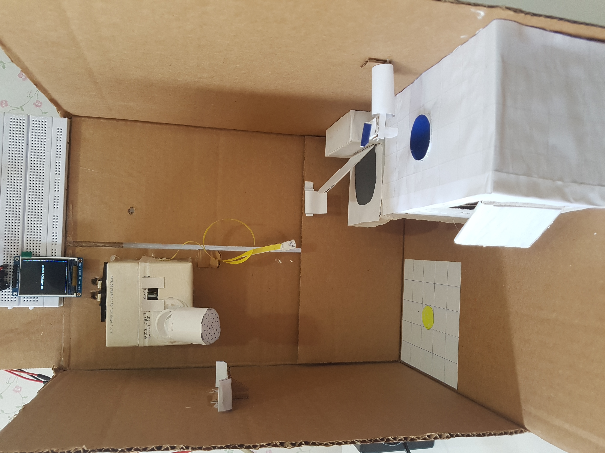

# Real-Time Energy Consumption Monitor
# Monitor de Consumo Elétrico em Tempo Real

---

# ⚠️ Safety Notice / Aviso de Segurança

**PT**

Este projeto foi desenvolvido **exclusivamente para fins educacionais e de estudo em sistemas embarcados**.

Ele **não deve ser conectado diretamente a chuveiros elétricos ou instalações elétricas reais**, pois trabalhar com tensão da rede elétrica envolve **risco sério de choque elétrico, queimaduras e morte**.

Qualquer experimento envolvendo tensão da rede deve ser realizado **somente em ambiente controlado, com isolamento adequado e supervisão técnica qualificada**.

O autor **não se responsabiliza por qualquer uso indevido deste projeto**.

---

**EN**

This project was developed **for educational and embedded systems study purposes only**.

It **must NOT be connected directly to real electric showers or household electrical installations**, since working with mains electricity involves **serious risk of electric shock, burns, and death**.

Any experiment involving mains voltage should be performed **only in controlled environments with proper electrical isolation and qualified supervision**.

The author **is not responsible for any misuse of this project**.

---

# Project Overview / Descrição do Projeto

**EN**

The **Real-Time Energy Consumption Monitor** is an embedded system designed to estimate the electrical energy consumption during a shower.

The system measures electrical parameters using voltage and current sensors and calculates:

- RMS Voltage (Vrms)
- RMS Current (Irms)
- Instantaneous Power
- Energy Consumption
- Estimated Energy Cost

All data is processed in real time by a microcontroller and displayed on a **TFT ST7735 display**.

A **60-second timer** is used to generate a visual alert for excessive shower duration. After the shower ends, the system shows a **summary screen** with energy consumption and estimated monthly cost.

---

**PT**

O **Monitor de Consumo Elétrico em Tempo Real** é um sistema embarcado desenvolvido para estimar o consumo de energia elétrica durante um banho.

O sistema mede parâmetros elétricos utilizando sensores de tensão e corrente e calcula:

- Tensão RMS (Vrms)
- Corrente RMS (Irms)
- Potência Instantânea
- Energia Consumida
- Custo Estimado de Energia

Todos os dados são processados em tempo real por um microcontrolador e exibidos em um **display TFT ST7735**.

Um **temporizador de 60 segundos** gera um alerta visual para indicar tempo elevado de banho. Ao final do banho, o sistema exibe **uma tela de resumo com consumo total e estimativa de custo mensal**.

---

# Demonstration Video / Vídeo de Demonstração

Watch the system operating in the video below:

Assista ao sistema em funcionamento no vídeo abaixo:

https://www.youtube.com/watch?v=cBljlx1Ge4c

---

# Prototype Photos / Fotos do Protótipo

Photos of the hardware prototype are available in the repository folder:

As fotos do protótipo físico estão disponíveis na pasta:
/prototype

These images show the experimental hardware setup used during development.

Essas imagens mostram o protótipo utilizado durante o desenvolvimento.
## Prototype Screens

  
  
  

  
  
  

  
  

---

# Repository Structure / Estrutura do Repositório

project-root
│
├── prototype
│ └── photos of the physical prototype
│
├── src
│ └── main.cpp
│
└── README.md

**PT**

- `prototype/` → fotos do protótipo físico  
- `src/` → código fonte do sistema  
- `README.md` → documentação do projeto  

**EN**

- `prototype/` → hardware prototype photos  
- `src/` → system source code  
- `README.md` → project documentation  

---

# Hardware Components / Componentes de Hardware

| Component | Description |
|----------|-------------|
| Microcontroller | Arduino-compatible board |
| Voltage Sensor | ZMPT101B |
| Current Sensor | ACS712 |
| Display | TFT ST7735 |
| Connections | Breadboard and jumper wires |

---

# Software Requirements / Requisitos de Software

**EN**

Development environment:

- Arduino IDE

Required libraries:

- Adafruit_GFX
- Adafruit_ST7735
- SPI (built-in Arduino library)

---

**PT**

Ambiente de desenvolvimento:

- Arduino IDE

Bibliotecas utilizadas:

- Adafruit_GFX
- Adafruit_ST7735
- SPI (biblioteca nativa do Arduino)

---

# System Calculations / Cálculos do Sistema

| Quantity | Formula | Unit |
|--------|--------|--------|
| Power | Vrms × Irms | W |
| Energy | Power × (Δt / 3600000) | Wh |
| Cost | (Wh / 1000) × Tariff | R$ |
| Countdown | 60 − elapsed_time | seconds |

Default parameters:

Tariff = **0.87513 R$/kWh**

Estimated showers per month = **30**

---

# System States / Estados do Sistema

The system operates using a **finite state machine**.

WAITING → IN_SHOWER → SUMMARY → WAITING

State transitions:

| Condition | Action |
|--------|--------|
| Vrms > 45V | Shower detected |
| Vrms < 30V | Shower finished |
| 10 seconds | Return to waiting mode |

---

# Display Interface / Interface do Display

The TFT display shows real-time information including:

- elapsed shower time
- RMS voltage
- RMS current
- instantaneous power
- energy consumption

Color indicators:

| Color | Meaning |
|------|------|
Green | Normal consumption (< 60 seconds) |
Red | High consumption alert |
Yellow | System alerts |
Cyan | Titles and summary borders |

---

# Project Limitations / Limitações do Projeto

This project focuses on **software implementation and system logic**.

A complete electrical schematic is **not included in this repository**.

The prototype was developed only to demonstrate the measurement and monitoring concept.

---

# Possible Improvements / Possíveis Melhorias

Future versions of this project could include:

**EN**

- IoT connectivity
- cloud energy monitoring
- mobile application
- data logging
- acoustic alerts
- full electrical schematic

**PT**

- conectividade IoT
- monitoramento em nuvem
- aplicativo mobile
- armazenamento de dados
- alertas sonoros
- esquemático completo do circuito

---

# Author / Autor

**Roberto Leonel Stefan**

Embedded Systems Engineering

February 10, 2026
